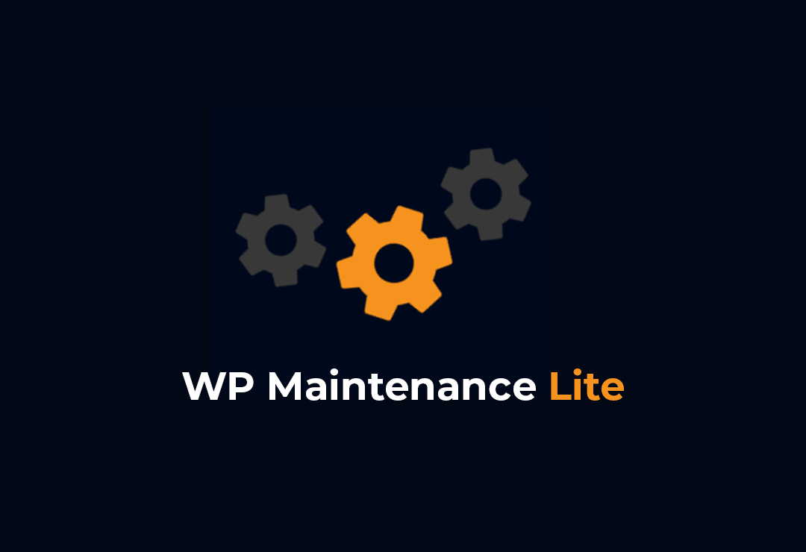
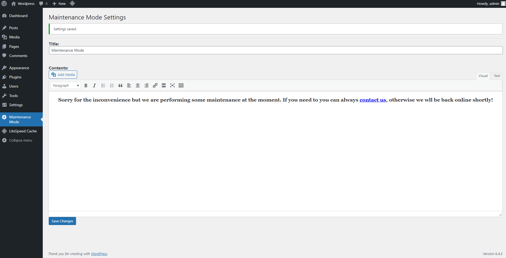
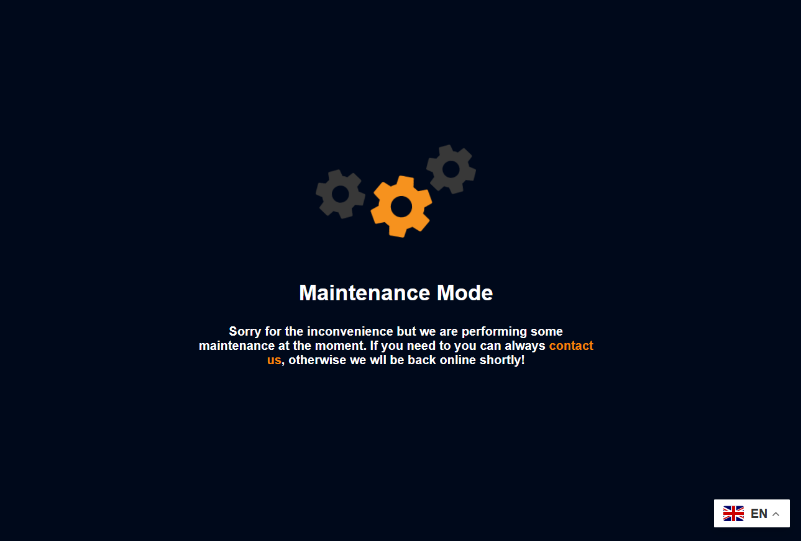

# WordPress Maintenance Mode Lite

**Enables an easy Maintenance mode for WordPress websites.**

## Overview

WordPress Maintenance Mode Lite is a simple and lightweight plugin that allows you to put your WordPress site into
maintenance mode with ease. This is useful when you need to perform updates, make changes to your site, or carry out
maintenance tasks.

## Features

- Quickly enable or disable maintenance mode.
- Customizable maintenance page with HTML content.
- Allow logged-in users to access the site during maintenance.

## Installation

1. Download the latest release from the [GitHub repository](https://github.com/JosephChuks/wp-maintenance-lite/releases).
2. Upload the plugin zip file to your WordPress site.
3. Activate the plugin through the WordPress admin.

## Usage

1. After activation, go to the "Maintenance Mode" settings page under the WordPress admin.
2. Customize the title and content for your maintenance page.
3. Save changes and your site will be in maintenance mode for visitors.

## Screenshots

*Customize the title and content for your maintenance page.*

*Example of the maintenance page displayed to visitors.*

## Contributions

Contributions are welcome! If you have suggestions, bug reports, or want to contribute to the development, feel free to
open an issue or submit a pull request.

## License

This plugin is licensed under the [GNU General Public License v2 or later](LICENSE.md).

## Support

For support and inquiries, please [open an issue](https://github.com/JosephChuks/wp-maintenance-lite/issues) on
GitHub.

---

**Author:** Your Name
**GitHub:** [JosephChuks](https://github.com/JosephChuks)
